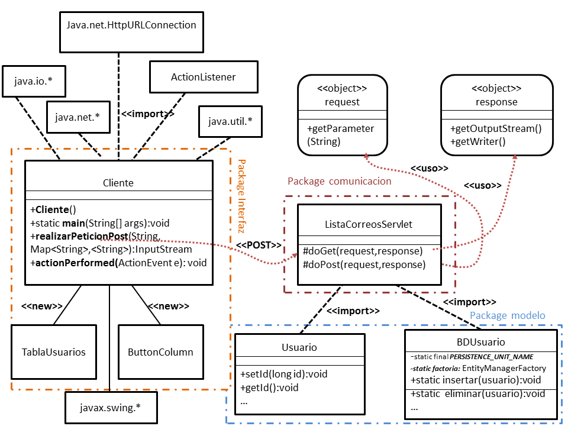
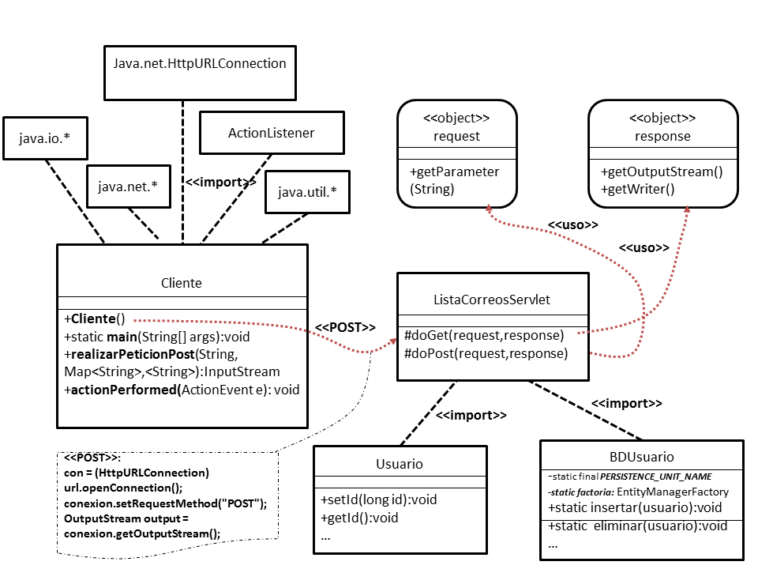
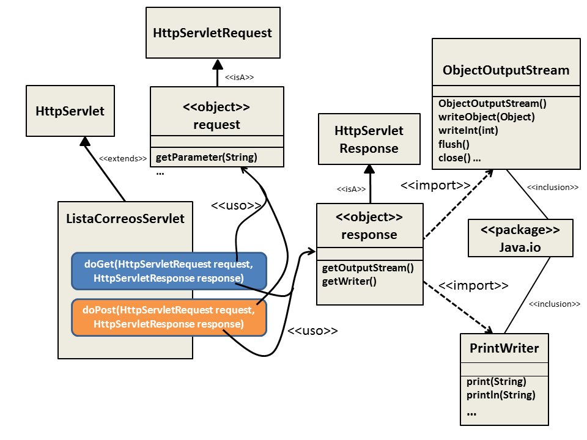
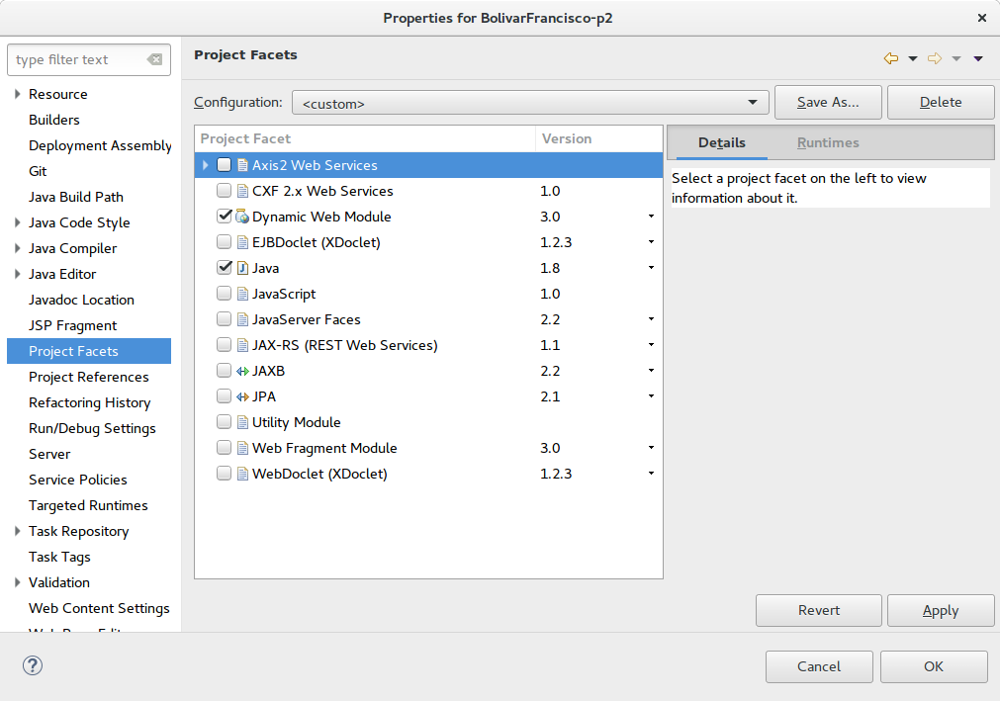
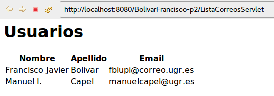
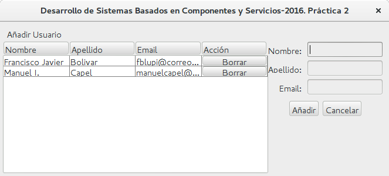

# Práctica 2: Programación OO con persistencia de entidades

## Enunciado

Utilizando JPA, se pide programar una aplicación para crear Listas de Correo que utilizará un canal (DBUsuario) para escribir los datos de los usuarios de una Lista de Correo en una base de datos. La aplicación ha de utilizar un "connection pool" para permitir conectar rápidamente las hebras de usuarios a la base de datos.

Ejecutar la aplicación como un proyecto Java en un IDE y utilizarla para añadir usuarios a la lista de correo. Utilizar Workbench o una herramienta similar para ver las tablas de la base de datos, la cual deberá incluir una tabla llamada "usuario"  con columnas que se corresponderán con los campos de la clase Usuario (leer más abajo).

Crear una aplicación de **Administración de Usuarios** que permita visualizar a todos los usuarios, actualizar los usuarios existentes y eliminar los usuarios almacenados en la tabla Usuario de la base de datos.

## Software Utilizando

* Ubuntu 16.04
* Oracle JDK 8
* Eclipse for Java EE 4.6 (Neon)
* EclipseLink 2.6.4
* Apache Tomcat 9.0.0.M11
* Apache Derby 10.13.1.1

## Diagramas

## Configuración del proyecto

* Añadir las librerías que hay en WebContent/WEB-INF/lib en el Build-Path.
* Cerciorarse de que las propiedades del proyecto coinciden con las siguientes y configurar el Apache Tomcat para ejecutarlo ahí

## Instrucciones de ejecución

* Ejecutar el servlet. Click derecho en `ListaCorreosServlet.java` y hacer Run As... -> Run on server

* Ejecutar el cliente. Click derecho en `Cliente.java` y hacer Run As... -> Java Application

