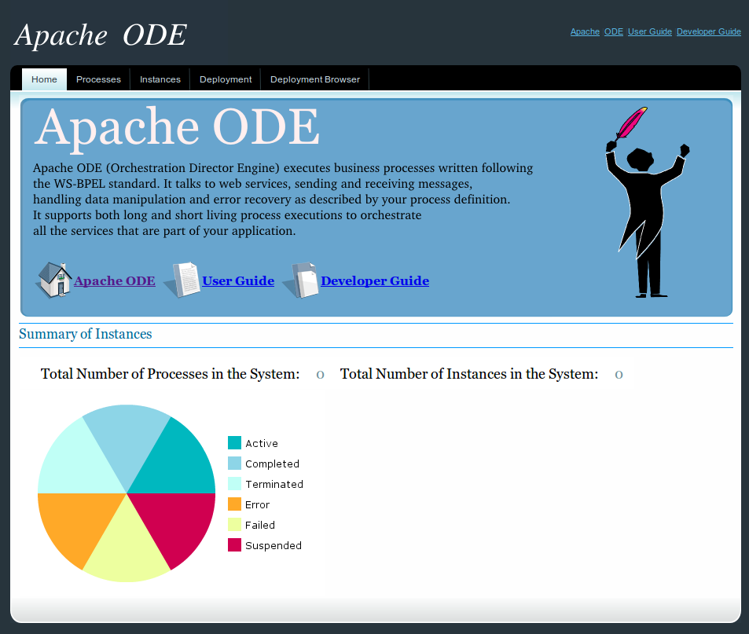

## Configuración del marco de trabajo de la práctica

### Versiones utilizadas

* Ubuntu 16.04 o Windows 10
* Oracle JDK 8
* Eclipse for Java EE 4.6 (Neon)
* Apache Tomcat 9.0.0.M11
* Apache ODE 1.3.6
* BPEL Designer 1.0.5

### Preconfiguración

#### Instalar BPEL Designer en Eclipse

* *Help* -> *Install new software* -> *Add*
* En *Location*: http://download.eclipse.org/bpel/site/1.0.5/ y pulsar *OK*.
* Seleccionar todo, *Next*, aceptar condiciones y *Finish*.
  * Si aparece un error de *Timeout* instalar todos los paquetes de uno en uno.

#### Instalar ODE Server

##### Descargar e instalar WAR

* Descargar desde este enlace: http://apache.mindstudios.com/ode/apache-ode-war-1.3.6.zip
* Mover `ode.war` al directorio `webapps` de Apache e iniciar Apache.
* Entrar en http://localhost:8080/ode/ y tenemos que obtener una página similar a esta:

##### Crear servidor

* Abrir la perspectiva *Servers* en Eclipse y seleccionar *New*.
* Seleccionar *Ode v1.x server* dentro del paquete Apache y completar con:
  * En *JRE*: `java-8-oracle`
  * En *ODE's home directory*: `/opt/apache-tomcat-9.0.0.M11/webapps/ode`
  * En *Tomcat's home directory*: `/opt/apache-tomcat-9.0.0.M11`
  * En *Server address*: `localhost`
  * En *Port*: `8080`
  * En *VM Arguments*: `-Xms128m -Xmx512m -XX:MaxPermSize=256m`
* Una vez creado, hacer click dos veces en su nombre y entrar en *Open launch configuration* y en la pestaña *Classpath*, en *User Entries* hacer click en *Add External JARs...* y seleccionar `/opt/apache-tomcat-9.0.0.M11/bin/tomcat-juli.jar`

### Despliegue de un proceso BPEL

* Crear un proyecto BPEL: *File* -> *New* -> *Other...* -> *BPEL2.0* -> *BPEL Project*.
  * En *Project name*: `ODE_Prueba`
  * En *Target Runtime*: `Apache Ode 1.x Runtime`

* Ahora crear el proceso BPEL, para ello en la carpeta *bpelContent* seleccionar *New* -> *Other...* -> *BPEL2.0* -> *New BPEL process file*:
  * En *Createion Mode*: `Create BPEL process from a template`
  * En *Process Name*: `HolaMundo`
  * En *Namespace*: `http://holaMundo`
* Pulsar en *Next* y:
  * En *Template*: `Synchronous BPEL Process`
  * En *Service Name*: `HolaMundoService`
  * En *Port Name*: `HolaMundoPort`
  * En *Service Address*: `http://localhost:8080/ode/processes/HolaMundo`
  * En *Binding Protocol*: `SOAP`

* En *Palette* -> *Actions*, arrastrar `Assign` debajo de `receiveInput`.
* Eliminar el `FIX_ME-Add_Business_Logic_Here`
* En el `Assign` hacer click derecho y pulsar en *Show in properties*.
  * Seleccionar la pestaña *Details* y pulsar en *New*
  * En *From* poner el `input : string` que hay desplegando `input : HolaMundoRequestMessage` -> `payload : HolaMundoRequest`
  * En *To* poner el `result : string` que hay desplegando `output : HolaMundoResponseMessage` -> `payload : HolaMundoResponse`
  * Preguntará por inicializar una variable, seleccionar *Yes*

* Hacer doble click en el archivo `HolaMundoArtifacts.wsdl` y pasarse a la pestaña *Design*
* En `HolaMundoPort` de `HolaMundoService` seleccionar las siguientes opciones:
  * En *Name*: `HoalMundoPort`
  * En *Binding*: `HolaMundoBinding`
  * En *Address*: `http://localhost:8080/ode/processes/HolaMundo`
  * En *Protocol*: `SOAP`

* Ahora crear el descriptor de despliegue, para ello en la carpeta *bpelContent* seleccionar *New* -> *Other...* -> *BPEL2.0* -> *BPEL Deployment Descriptor*
* Abrir `deploy.xml` y en *Inbound Interfaces (Services)* -> *Associated Port* seleccionar el puerto creado anteriormente, seleccionar en *Related Service* y el resto se rellenará automáticamente

* Agregar el proyecto al *Server* creado con anterioridad

* Hacer click derecho den `HolaMundoArtifacts.wsdl` y en *process* se puede probar escribiendo en *Body* y hacer click en *Go*. Debajo se mostrará el resultado
